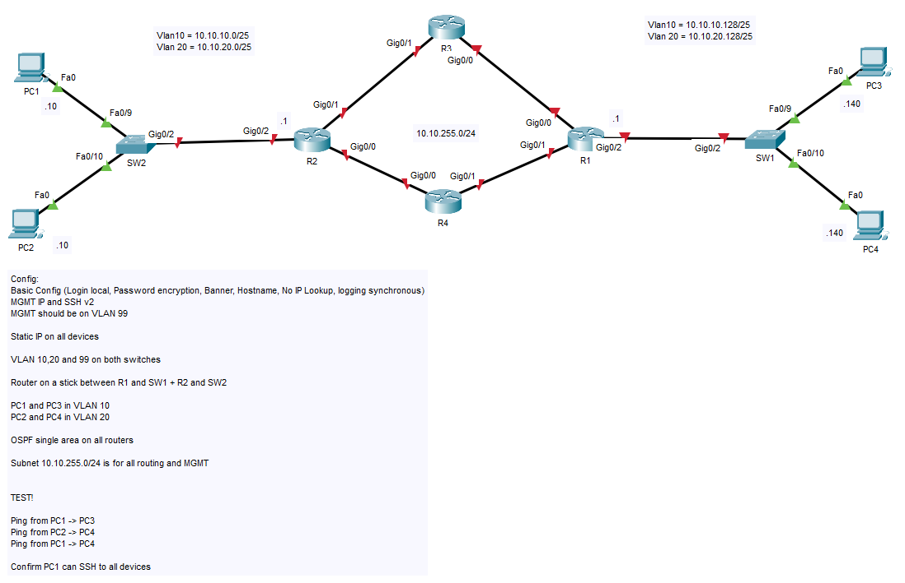

## 04. Basic OSPF Routing

Skill required: Novice

Requirements:

*Cisco PacketTracer Version: 8.1.1.0022 or newer*

*Basic Cisco PacketTracer understanding*

*Basic Cisco IOS understanding* 

## Content

This hands-on assignment will test if your able to setup basic device config, client config and simple network with OSPF routing. Please refer to below topology to get a idea about the assignment.

