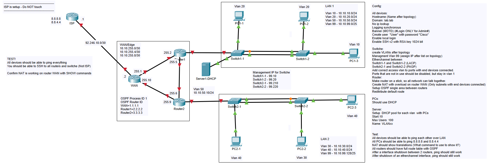

## 01. Medium mixed Topology

Skill required: Intermediate

Requirements:

*Cisco PacketTracer Version: 8.1.1.0022 or newer*

*Basic Cisco PacketTracer understanding*

*Basic CCNA commands knowledge* 

## Content

This hands-on assignment will test if your able to setup basic device config, client config, switch, OSPF and NAT. Please refer to below topology to get a idea about the assignment.

